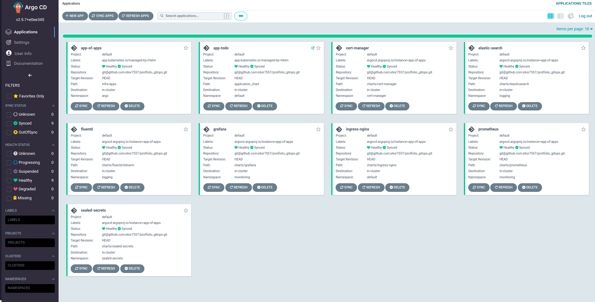

# DevOps Protfolio - Infra Repo

This repository contains the necessary Terraform files to deploy the infrastructure of [this application](https://github.com/elior7557/protfolio-DevOps-application.git) , it deploys a GKE (Google Kubernetes Engine) cluster in Google Cloud. The repository has 3 modules which are as follows:

 * **module "cluster"**: This module deploys the GKE cluster.
 * **module "argocd"**: This module deploys Argo CD with two YAML files, apps-of-apps.yaml which deploys the necessary infrastructure apps, and application.yaml which deploys the application chart.
 * **module "sealed-secret"**: This module deploys the key into the cluster, and the keys origin is in GCP (Google Cloud Platform) Secret Manager.

# providers
 * **helm**: This provider is used to manage Kubernetes applications.
 * **kubernetes**: This provider is used to interact with Kubernetes clusters.
 * **google**: This provider is used to interact with Google Cloud.

## configuration needed
- default configuration in terrafrom.tfvars.
- configure a project in gcp with k8s api enabled
- [gitops repositroy](https://github.com/elior7557/protfolio_gitops.git) in order to deploy application charts.
### note
sealed secrets are used as a dependency for this application to work.

# The Result after Terrarom Apply

